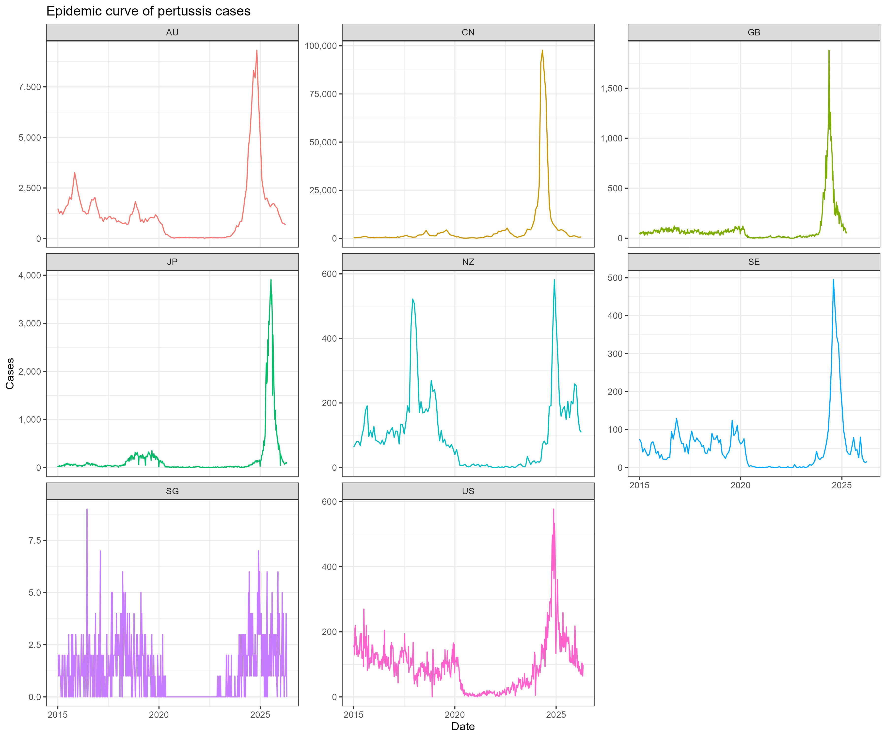

# Pertussis Incidence Surveillance Analysis

This repository snapshot contains the analysis code and curated source files used for the manuscript:

Pertussis Incidence After the COVID-19 Pandemic: Multi-Country Surveillance and Digital Signal Analysis.

## Runtime

The analysis was run with R 4.5.2. Required R packages include `tidyverse`, `openxlsx`, `lubridate`, `sf`, `ggsci`, `paletteer`, `patchwork`, `lme4`, `lmerTest`, `emmeans`, `ggpubr`, `ggridges`, `grid`, and `gtable`.

Python 3 is only needed for optional data-acquisition utilities (`healthmap.py`, `japanClean.py`, and `japanJHIS.py`). The curated input files needed to reproduce the manuscript figures and tables are already included in `Data/`.

## Included Input Files

- `Data/Pertussis incidence.xlsx`: weekly or monthly national surveillance records and population denominators.
- `Data/Pertussis case year age.xlsx`: grouped age-distribution source data.
- `Data/HealthmapData.csv`: HealthMap alert records used as digital surveillance signals.
- `Data/annual_case_overrides.csv`: CDC annual pertussis surveillance totals used to calibrate US weekly NNDSS interval counts for 2015-2025.
- `Data/iso3.csv` and `Data/world.zh.json`: country mapping and map geometry inputs for Figure 1.

The large `Data/OxCGRT_PHSM.csv` file is not required for the current manuscript analysis.

## Reproduction Order

Run the scripts from the repository root:

```r
source("Code/data.R")
source("Code/fig1.R")
source("Code/fig2.R")
source("Code/fig3.R")
source("Code/fig4.R")
```

Expected outputs are written to `Outcome/` and `Outcome/fig data/`.

## Analytical Notes

- HealthMap records are treated as alert records, not verified outbreak counts or unique events.
- US weekly NNDSS interval counts are retained as `CasesRaw` and `RawIncidence`. For 2015-2025, the analysis fields `AnalysisCases` and `AnalysisIncidence` scale those interval counts within each year to CDC annual pertussis surveillance totals.
- For other countries, `AnalysisCases` and `AnalysisIncidence` equal the reporting-interval sums and interval incidence.
- Formal LMM comparisons use complete calendar-year stages only; partial UK 2025 and partial 2026 observations are shown descriptively.
- Age-distribution medians are estimated from expanded grouped age distributions. LOESS smoothing is used only for density visualization.

## Data Sources

| Country or reporting jurisdiction | Country code | Frequency | Data source |
| --- | --- | --- | --- |
| the United States | US | Weekly | [National Notifiable Diseases Surveillance System](https://www.cdc.gov/nndss/) |
| UK-related reports | GB | Weekly | [UKHSA notifiable diseases in England and Wales](https://www.gov.uk/government/collections/notifiable-diseases-in-england-and-wales) |
| Sweden | SE | Monthly | [Kikhosta - sjukdomsstatistik](https://www.folkhalsomyndigheten.se/folkhalsorapportering-statistik/statistik-a-o/sjukdomsstatistik/kikhosta/) |
| China | CN | Monthly | [National Disease Control and Prevention Administration](https://www.ndcpa.gov.cn/jbkzzx/c100016/common/list.html) |
| Japan | JP | Weekly | [National Institute of Infectious Diseases / JIHS](https://id-info.jihs.go.jp/) |
| Singapore | SG | Weekly | [Weekly Infectious Diseases Bulletin](https://www.moh.gov.sg/resources-statistics/infectious-disease-statistics/2015/weekly-infectious-diseases-bulletin) |
| Australia | AU | Monthly | [National Communicable Disease Surveillance Dashboard](https://nindss.health.gov.au/pbi-dashboard/) |
| New Zealand | NZ | Monthly | [Monthly notifiable disease surveillance reports](https://www.esr.cri.nz/digital-library/) |

## Data Preview


